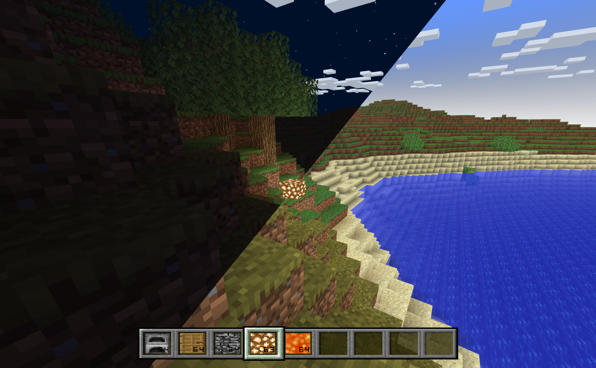

# MiiCraft
MiiCraft is a "demake" of Minecraft for the Nintendo Wii trying to replicate the original Minecraft experience on the Wii hardware.
It's more a proof of concept / tech demo than a full game, but it has many features that make it enjoyable to play.



# Features
- Cube-shaped blocks rendering (solid, transparent, semi-transparent and animated textures)
- Advanced lighting system including smooth voxel lighting and ambient occlusion
- Separate light channels for sunlight and torchlight
- Day/night cycle with smooth transitions and dynamic skybox
- Simple world generation and biome system
- Local multiplayer support (up to 4 players) on a single Wii console (split-screen)
- Basic crafting and inventory system
- Advanced rendering optimizations for smooth performance
- Dynamic chunk generation
- Solid cloud
- Motion controls support (Wii Remote and Nunchuk)
- Compatible with Wii U's vWii mode & Dolphin emulator
- ...

# Missing Features (not implemented)
- No mobs or animals
- No redstone or complex mechanisms
- No online multiplayer
- No modding support
- No sound or music
- No advanced terrain generation (e.g. caves, ravines, etc.)
- No advanced weather effects (e.g. rain, snow, etc.)
- No chunk loading/unloading, stop generating at 601 chunks (Wii RAM limit)
- **No save**
- ...

# Build
To build MiiCraft, you need the devkitPPC toolchain installed. You can get it from [devkitPro](https://devkitpro.org/wiki/Getting_Started).
Wii development suits are also required, which can be installed using the devkitPro pacman package manager.
Python 3.12+ is also required to run the build scripts and assets generation, with the following packages:
- `opencv-python` for image processing
- `numpy` for numerical operations
- `tqdm` for progress bars

You can build the project using the following commands:

```bash
cmake -DCMAKE_TOOLCHAIN_FILE=<path-to-devkitpro>/cmake/Wii.cmake
cmake --build .
```

This generates the executable files `Miicraft.dol` and `Miicraft.elf` in the build directory.
Both works on the Wii, but the DOL file is more suitable for homebrew channels and loaders,
while the ELF file is more suitable for debugging and development.

# Credits
- Thanks to DevKitPro for the devkitPPC toolchain and libraries allowing Wii development.
 - Thanks to the Minecraft community for inspiration and ideas.
 - Thanks to the original Minecraft developers for creating such an iconic game.

# Licence MIT
This project is licensed under the MIT License - see the [LICENSE](LICENSE) file for details.
